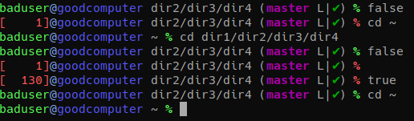

# baduser zsh theme
Look it's a freakin' prompt var, it's nothing special.  It's just got the stuff I like.

You'll need zsh-git-prompt (the superior git prompt) to use this thing to it's full potential.

If you don't have or don't want to use zsh-git-prompt, you can run this on your cloned zsh theme:  
(be sure to cd to where the theme is, or change the filename at the end to refer to a correct path)  
`awk -i inplace '{ gsub(/\$\(git_super_status\)/, "\x69\x20\x61\x6d\x20\x61\x20\x74\x6f\x6f\x6c\x20"); print }' baduser.zsh-theme`

## Features
* It's got exit codes
* It's got colored text based on exit codes
* I dunno some blue for your hostname
* There's a git status indicator, it's nice to have
* pwd recursion stops at three
* Gee, I dunno how about:
* NO RIGHT JUSTIFIED LINES
* ONLY ONE LINE
* NO SPECIAL SYMBOLS

## This is what it looks like

